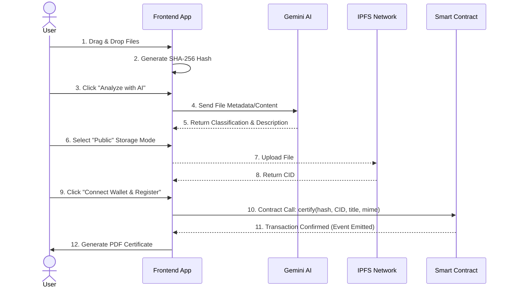
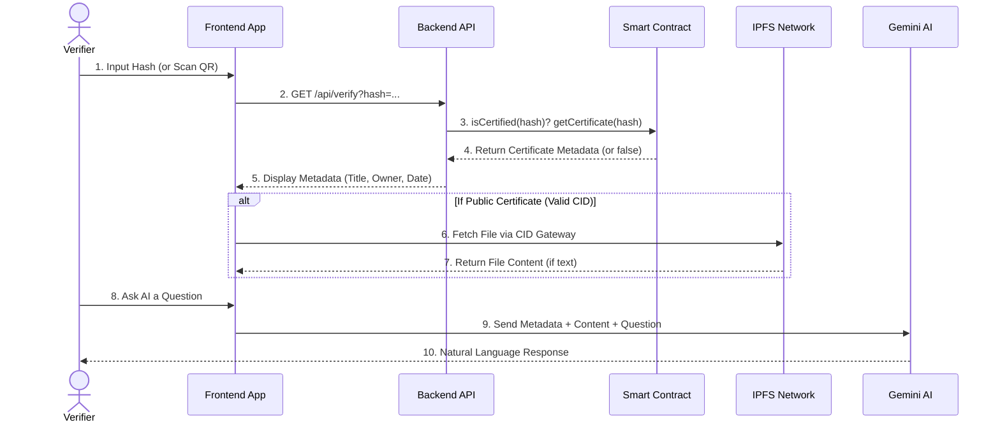

# VeriChain Architecture

VeriChain is a decentralized, AI-enhanced application (dApp) for generating, storing, and verifying proofs-of-existence for digital assets. It leverages blockchain for immutability, IPFS for decentralized storage, and Google's Gemini AI for deep contextual analysis.

## High-Level System Architecture

```mermaid
graph TD
    %% Core Entities
    User((User))
    Browser["Frontend Client<br/>(React, Vite, Tailwind CSS)"]
    MetaMask{"MetaMask Wallet"}
    
    %% External Services
    Gemini["Google Gemini AI<br/>(via API)"]
    IPFS[("IPFS Storage<br/>(Public/Private Option)")]
    
    %% Blockchain & Backend
    SmartContract[{"VeriChain Smart Contract<br/>(Solidity, Polygon/Local)"}]
    Backend["Backend Service<br/>(Node.js, Express)"]

    %% Connections
    User -- Uploads files & Interacts --> Browser
    Browser -- Requests signature & Connects --> MetaMask
    MetaMask -- Broadcasts Transaction --> SmartContract
    Browser -- Queries Hash/Events --> SmartContract
    
    Browser -- "1. Upload File (if Public)" --> IPFS
    Browser -- "2. Fetch File (Verify)" --> IPFS
    
    Browser -- "Reads Metadata & Content" --> Gemini
    Gemini -- "Classification, Descriptions, Chat" --> Browser
    
    Browser -- "Off-chain Verification Query" --> Backend
    Backend -- "Reads from Contract" --> SmartContract
```

## Component Breakdown

### 1. Frontend Client
Built with **React, Vite, and Tailwind CSS**, the frontend is the engine that drives user interactions. 
- **Local Hashing:** Files are hashed using SHA-256 entirely in the browser using the Web Crypto API, meaning raw sensitive files never needlessly touch a server unless directed to IPFS.
- **Certificate Generation:** Uses `html2canvas` and `jspdf` to dynamically render rich HTML themes into downloadable PDF credentials.
- **State Management:** Manages step-by-step flows, handles local caching of blockchain events for the "My Certificates" gallery.

### 2. Smart Contract (Blockchain Layer)
Written in **Solidity** (`VeriChain.sol`), deployed to Hardhat localhost (and production-ready for Polygon Amoy).
- **Core State:** Maps `bytes32 fileHash` to a `Certificate` struct containing: `owner` (address), `ipfsCid` (string), `timestamp` (uint256), `title` (string), and `mime` (string).
- **Identity:** Relies purely on the cryptographic signature of the interacting wallet (`msg.sender`). No traditional email/password databases exist.
- **Events:** Emits a `Certified` event upon successful registration, which the frontend indexes to build the user's personal gallery without needing a centralized database.

### 3. AI Layer (Google Gemini 2.5 Flash)
Integrated directly via `ai.js`, the AI layer provides intelligent augmentation to the certification process:
- **Intelligent Classification & Heuristics:** Scans file extensions and frequencies to determine the project type (Technical, Academic, Creative) and assigns appropriate visual themes.
- **Heuristic Risk Scoring:** A client-side rules engine checks for suspicious patterns (empty files, excessive duplicates, executables) before permitting certification.
- **Contextual Assistants:**
    - *Creation Phase:* AI reads the text content of uploaded project files, allowing users to ask questions like *"What does this code do?"* before certifying.
    - *Verification Phase:* AI digests blockchain metadata (and IPFS content if public) to answer verification queries naturally.

### 4. IPFS (Decentralized Storage)
Handles file permanence so large assets don't bloat the blockchain.
- **Public Mode:** Files are uploaded to IPFS. The resulting Content Identifier (CID) is stored on the blockchain. Verifiers can download the exact file linked to the hash.
- **Private Mode:** Bypasses IPFS. The files remain exclusively with the owner, and only the SHA-256 hash is anchored to the blockchain for auditing purposes.

## Core Workflows

### 1. The Certification Flow


### 2. The Verification Flow


## Security & Privacy Considerations
1. **Zero-Knowledge Capabilities:** The "Private Mode" allows organizations to prove existence of confidential documents (NDAs, trade secrets) without revealing the contents.
2. **Immutable Traceability:** Because `msg.sender` is irrevocably tied to the hash, identity spoofing is mathematically infeasible.
3. **No Central Point of Data Failure:** Removing centralized databases means there is no central honeypot to hack. User profiles are derived entirely from blockchain states.
